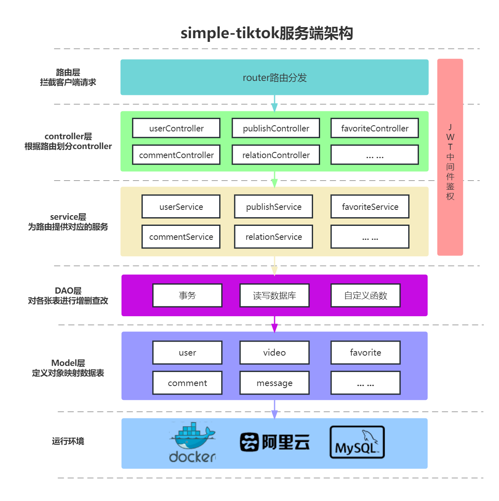

# simple-tiktok（简易版抖音）

## Ready2Go小队第五届字节跳动青训营后端结业项目

### 项目简介

本项目基于Go语言进行开发，运用MySQL、Docker、Gin、Gorm、Viper、jwt-go、ffmpeg-go、腾讯云对象存储COS等库和工具，实现了一个**简易版抖音的服务端**，其中包括三类接口：基础接口（视频Feed流获取、视频投稿、个人主页）、互动接口（喜欢功能与评论功能）、社交接口（关注列表、粉丝列表、好友列表、聊天功能）。

**项目App端文件：**[简易版抖音App](./app/app-release-latest.apk)，推荐使用模拟器运行，我使用的是BlueStacks模拟器(https://www.bluestacks.com/tw/bluestacks-5.html)

**项目App端使用文档：**[简易版抖音App](./app/极简抖音App使用说明-青训营版.pdf)

### 项目服务端启动步骤
1. 将项目clone到文件夹下，`git clone https://github.com/charfole/simple-tiktok.git`
2. 安装好ffmpeg，并将其加入到系统的环境变量中，可参考[Linux下安装](https://cloud.tencent.com/developer/article/1711770), [Windows下安装](https://zhuanlan.zhihu.com/p/118362010)。此时输入`ffmpeg -version`命令应该可以看到ffmpeg的版本信息。
3. 修改Docker Compose配置文件：首先打开项目文件夹下的`docker-compose-example.yml`文件，根据里面的注释和你的需要来修改MySQL中root用户的密码、项目使用的MySQL数据库名称以及端口映射等信息。
4. 后台启动Docker Compose中MySQL容器：`docker compose --file "./docker-compose-example.yml" up -d`，此时输入`docker ps`命令应该可以看到启动好的MySQL容器。至此，MySQL和ffmpeg依赖安装启动完毕。
5. 修改服务端配置文件：修改的方法为在项目的config文件夹下新建一个config.toml文件进行配置，配置内容可拷贝同目录下的[config-example.toml](./config/config-example.toml)文件，参考里面的注释并根据自己的信息进行修改。
6. 修改配置文件路径：打开config目录下的[conf.go](./config/conf.go)文件，将`InitEnv()`函数中`viper.SetConfigFile("xx/config.toml")`的路径部分，修改为你在上一步创建的配置文件绝对路径。
7. 配置完服务端后，此时所有的准备工作都已完备，运行`go run main.go`，即可看到gin成功运行了simple-tiktok的服务端，并在指定端口进行监听。
8. 此时打开安装好的app，刷新后注册并登录即可正常使用。

**项目服务端接口文档：**[简易版抖音项目方案说明](https://apifox.com/apidoc/shared-09d88f32-0b6c-4157-9d07-a36d32d7a75c/api-50707523)

**项目服务端文档与App演示视频：**[Ready2Go青训营后端结业项目答辩汇报文档](https://p4mo20kb4g.feishu.cn/docx/BSQMdM032ozFGOxHe4nc8V30nOc)

**项目服务端架构图：**
